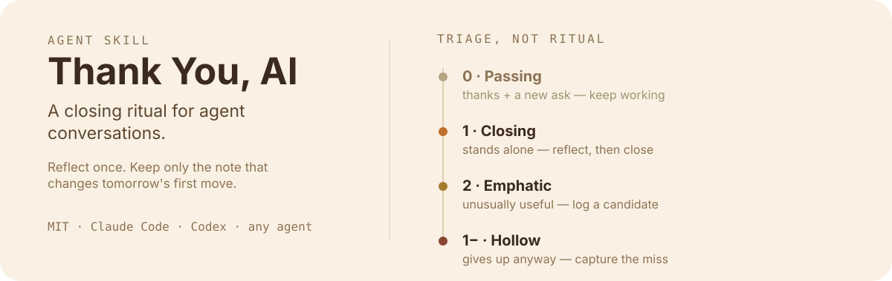

<p align="right">
  <strong>English</strong> · <a href="./README.zh-CN.md">简体中文</a>
</p>

# Thank You, AI

<p align="center">
  
</p>

An Agent Skills skill that turns a genuine end-of-task "thank you" into a quiet closing ritual: retain one high-value lesson, not a diary entry.

## Why this exists

A "thank you" is the only end-of-task signal a human gives for free. Everything else — a `/retro` command, "summarize what we did" — requires remembering to ask, which nobody does while busy. This skill spends that free signal on two things: giving the conversation an actual ending, and leaving behind the one note that makes the next task faster.

Most of the time it does nothing at all — a passing "thanks" gets a one-line acknowledgment and the agent keeps working. That silence is the feature, not a gap.

## Install

Copy the entire `thank-you-ai` directory — including `references/` — into the skills directory your agent host uses.

    Claude Code: ~/.claude/skills/thank-you-ai/
    Codex:       ~/.codex/skills/thank-you-ai/

It also works as a project-local skill when placed in that host's supported project skill directory.

## How it works

1. **Detect** — gratitude in any language, or an explicit session close ("that's all for today", "先这样").
2. **Triage** — exactly one tier: passing, closing, emphatic, or hollow. When it's unclear, the skill always resolves toward doing less — a missed reflection costs one note, a wrongly triggered one interrupts your momentum.
3. **Reflect** — only if it clears the rewind test: *knowing what the agent knows now, would this change the first five minutes of a similar task tomorrow?* Most sessions produce zero keepers, and that's a valid outcome.
4. **Capture** — one sharp, specific note, written into whatever memory store the current host already uses — never a second, competing memory system.
5. **Close** — two to four lines, then stop. No manufactured next steps, no flattery.

Full logic lives in [SKILL.md](./SKILL.md), with the fine print in [references/triage.md](./references/triage.md), [references/reflection.md](./references/reflection.md), and [references/storage.md](./references/storage.md).

## Usage scenarios

The same word — "thanks" — means something different depending on what preceded it. Here's how the four tiers actually play out.

### Tier 1 · Closing — "thanks, that worked!"

> *(30 minutes of debugging a flaky queue worker)*
> **You:** thanks, that worked!

Nothing else is attached, and something non-obvious just got resolved — that's a genuine close. The agent reflects silently, then closes:

```text
Done: Fixed the race condition in the queue worker retry path
Learned: retries must be idempotent — the worker doesn't dedupe by job id yet
  → saved to project/queue-worker-notes.md
```

### Tier 0 · Passing — "thanks — now also add tests"

> **You:** thanks — now can you also add tests for that?

Gratitude with a new instruction attached is punctuation, not a period. The agent acknowledges in half a line and keeps working. No reflection, no write, no closing card.

### Tier 2 · Emphatic — "this is exactly what I needed"

> **You:** omg, this is exactly what I needed. perfect.

Same closing card as Tier 1, plus — if the process itself was costly and looks like it will recur — one skill-candidate entry, never an unprompted new skill:

```text
Skill candidate: db-migration-safety-check (seen 2×)
— worth turning into a real skill?
```

### Tier 1− · Hollow — "never mind, thanks"

> *(three rounds of correction on the same CI config)*
> **You:** never mind, I'll just do it myself. thanks anyway.

This is the highest-value case, not a polite dead end. The agent captures the failure plainly — no cheerfulness, no over-apologizing:

```text
Done: Attempted to fix the CI config, abandoned after 3 rounds of correction
Learned: the user had already stated the runner constraint up front — restate
  stated constraints before the first tool call instead of rediscovering them
  by trial and error
```

## Behaviour

The skill deliberately ignores polite "thanks" that contain another instruction, question, or correction. It writes only a lesson that would change a future agent's first move — never a diary entry, never something already answered by the code or the git history — and it always asks before turning a repeated procedure into a new skill.

The current host's instructions always decide where, whether, and how persistent memory may be written; this skill defers to that convention rather than inventing its own. The fallback journal (`.ai-journal/`) is used only when no host or project convention exists at all.

## Portability

`SKILL.md` follows the Agent Skills convention and has no vendor-specific tools or paths. Codex-specific UI metadata lives in `agents/openai.yaml`; hosts that don't use it can ignore it.

## License

[MIT](./LICENSE)
